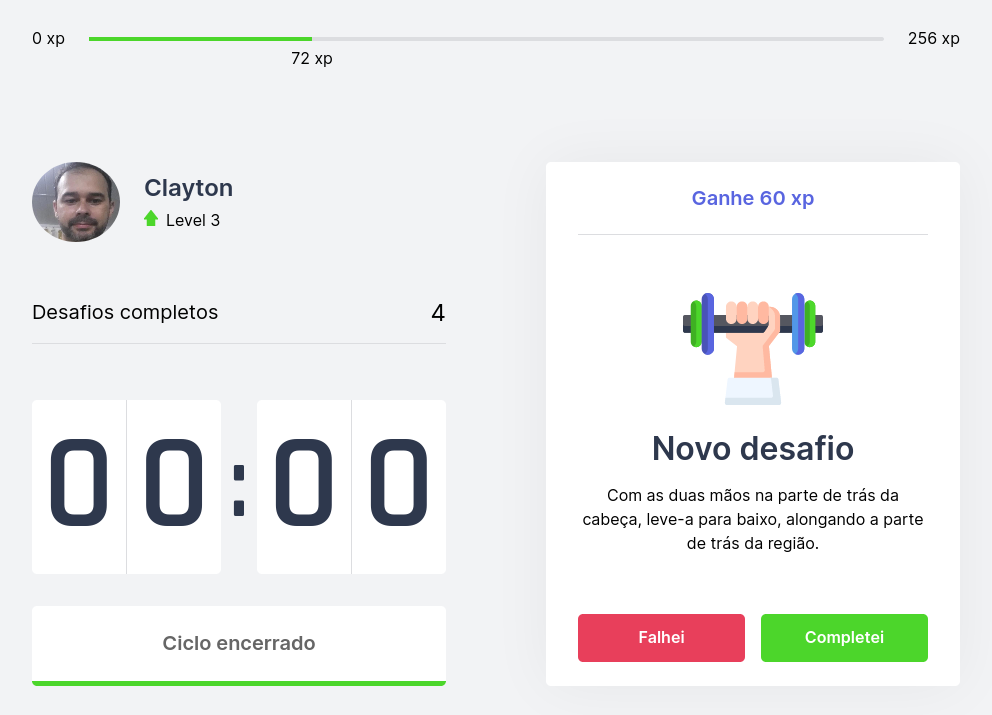

# Move.it


<p>O projeto Move.it foi desenvolvido durante um evento da RocketSeat 🚀 chamado Next Level Week #04, onde o instrutor Diego Fernandes ensina como dominar ferramentas de forma rápida e eficiente.</p>


<br/>
<br/>


## Configure seu ambiente local

<p>Copie o arquivo .env.local.example neste diretório para .env.local (que será ignorado pelo Git):</p>

```
cp .env.local.example .env.local
```

<p>Edite o arquivo adicione as configurações de autenticação do GitHub<p>

## Iniciando a aplicação

<p>Primeiro, execute o servidor de desenvolvimento:</p>

```bash
npm run dev
# ou
yarn dev
```

<p>Abra [http://localhost:3000] (http://localhost:3000) com seu navegador para ver o resultado.</p>

## Deploy no Vercel

A maneira mais fácil de implantar seu aplicativo Next.js é usar a [Plataforma Vercel] (https://vercel.com/new?utm_medium=default-template&filter=next.js&utm_source=create-next-app&utm_campaign=create-next-app -readme) dos criadores do Next.js.

Confira nossa [documentação de implantação Next.js] (https://nextjs.org/docs/deployment) para obter mais detalhes.

## Tecnologias utilizadas

O projeto foi desenvolvido utilizando as seguintes tecnologias

- [TypeScript](https://www.typescriptlang.org/)
- [NextJS](https://nextjs.org/)
- [ReactJS](https://reactjs.org/)
- [HTML](https://developer.mozilla.org/pt-BR/docs/Web/HTML)
- [CSS](https://developer.mozilla.org/pt-BR/docs/Web/CSS)
- [Yarn](https://yarnpkg.com/)

## 📝 Licença

Este projeto está sob a licença MIT. Consulte [LICENÇA](./LICENSE) para obter detalhes.
